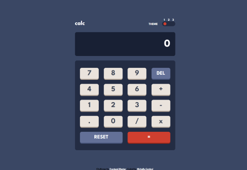
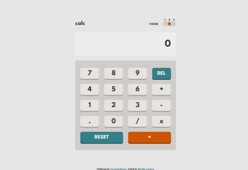
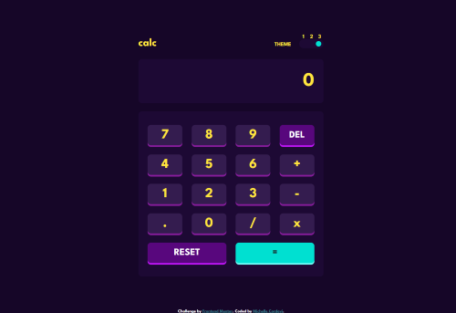

# Frontend Mentor - Calculator app solution

This is a solution to the [Calculator app challenge on Frontend Mentor](https://www.frontendmentor.io/challenges/calculator-app-9lteq5N29). Frontend Mentor challenges help you improve your coding skills by building realistic projects. 

## Table of contents

- [Overview](#overview)
  - [The challenge](#the-challenge)
  - [Screenshot](#screenshot)
  - [Links](#links)
- [My process](#my-process)
  - [Built with](#built-with)
  - [What I learned](#what-i-learned)
  - [Continued development](#continued-development)
- [Author](#author)
- [Acknowledgments](#acknowledgments)

## Overview

### The challenge

Users should be able to:

- See the size of the elements adjust based on their device's screen size
- Perform mathmatical operations like addition, subtraction, multiplication, and division
- Adjust the color theme based on their preference
- **Bonus**: Have their initial theme preference checked using `prefers-color-scheme` and have any additional changes saved in the browser

### Screenshot






### Links

- Solution URL: [https://github.com/michellecordovi/CalculatorApp]()
- Live Site URL: [https://michellecordovi.github.io/CalculatorApp/]()

## My process

### Built with

- HTML5
- CSS Flexbox
- CSS Grid
- JavaScript
- JavaScript Drag and Drop features


### What I learned

This project was one of the best learning experiences for JavaScript that I've had to date. Figuring out JS to allow for a functioning calculator with feature that I wanted proved to be a huge challenge and took me almost 3 days to get it functioning the way I wanted.

On top of that, this was the first time I had created a website with a color theme changer. I wanted to challenge myself so I made the toggle button not only responsive to clicks, but also drag and drop.

I'm particularly proud of the code I made to allow for continuous operations in the calculator (ie. 1+1*5/2)
```js
let print = []//what's printed on the screen
let num1;
let num2;
let operator;
let total;

//NUMBER CLICK FUNCTION
for (let i = 0; i < numbers.length; i++){
      numbers[i].onclick = () => {
            if (operator === undefined) {
                  print.push(numbers[i].innerHTML);
                  screen.innerHTML = parseFloat(print.join(""));
                  num1 = parseFloat(print.join(""));
            } else if (operator !== undefined) {
                  print.push(numbers[i].innerHTML);
                  screen.innerHTML = parseFloat(print.join(""));
                  num2 = parseFloat(print.join(""));
                  calculate(num1, num2);
            }
      };
}


//OPERATOR CLICK FUNCTION
for (let i = 0; i < operators.length; i++){
      operators[i].onclick = () => {
            if (operator === undefined) {
                  print = [];
                  operator = operators[i].innerHTML;
            } else if (operator !== undefined){
                  print = [];
                  screen.innerHTML = total;   
                  operator = operators[i].innerHTML;
                  num1 = total;
            } 
      }
}

//CALCULATE FUNCTION
function calculate(number1, number2) {
      if (operator === "+") {
            total = number1 + number2;
      } else if (operator === "-") {
            total = number1 - number2;
      } else if (operator === "/") {
            total = number1 / number2;
      }else if (operator === "x") {
            total = number1 * number2;
      }
}
```

### Continued development

After this project, I'd really like to practice my drag and drop features more. In the future I'd like to add a JS testing file as well using Mocha.

## Author

- Website - [Michelle Cordovi](https://www.linkedin.com/in/michelle-cordovi-pt-dpt-35588683/)
- Frontend Mentor - [@michellecordovi](https://www.frontendmentor.io/profile/michellecordovi)


## Acknowledgments

I can thank multiple people, including my husband, best friend, and mom for frequently testing out my calculator as I was creating it to let me know of any bugs that I hadn't found myself.
